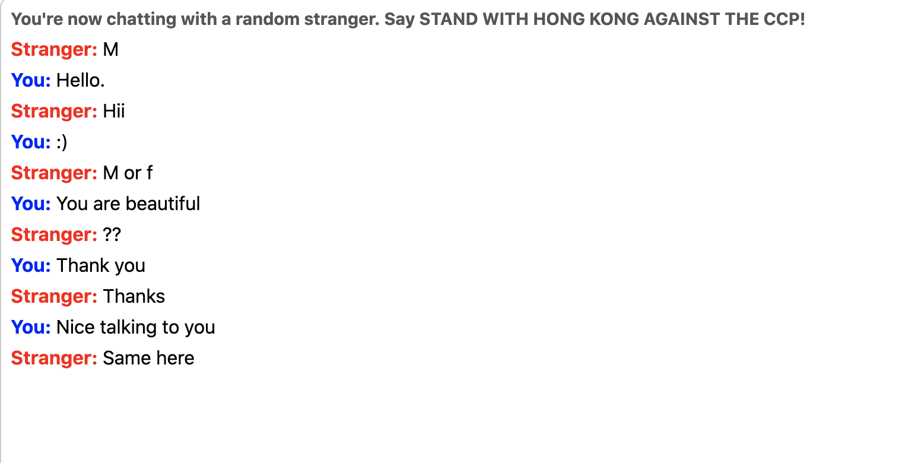

# OmegleBot

* Visit https://www.omegle.com/
* Click on Text
* Verify you are not a bot :)
* Open Developer Console. ( Google it if you are unaware of the term)
* Copy paste the OmegleBot.js code
* Change the message array and message interval according to need
* Relax and watch your bot simp.

